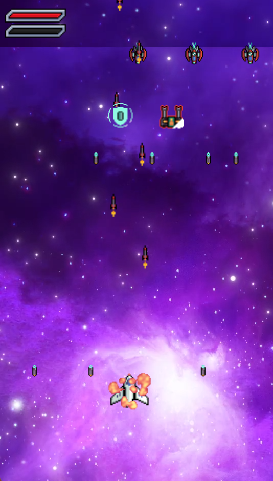
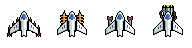

# 🛩️ Thunder Fighter

Thunder Fighter là trò chơi bắn máy bay được phát triển bởi:
-	Sú Minh Luân
-	Nguyễn Trần Quốc Thi

---

## 📌 Mục Tiêu Của Trò Chơi

- Điều khiển máy bay tiêu diệt càng nhiều kẻ địch càng tốt.
- Tránh né đạn và va chạm với máy bay đối phương.
- Thu thập vật phẩm tăng sức mạnh (power-up).
- Đạt điểm số cao nhất có thể.
- Vượt qua các màn chơi chỉ định

---

## 🎮 Cách Điều Khiển

| Thiết bị | Điều khiển |
|---------|------------|
| **PC** | - **Sử dụng chuột**: Di chuyển   - **P**: Tạm dừng (Chưa phát triển) |

---

## 🔫 Vũ Khí Và Power-up

- **Đạn đôi**: Bắn cùng lúc 2 viên đạn có sức mạnh lớn.
- **Tên lửa**: Bắn loạt viên đạn, tốc độ nhanh.
- **Cầu năng lượng**: Bắn quả cầu năng lượng có thể đi xuyên vật thể (Phá hủy đạn).
- **Laser**: Bắn ra 2 tia laser xuyên phát tất cả vật thể. (Đang phát triển)
- **Tạo giáp**: Tạo một lớp giáp bảo vệ khỏi các sát thương.

  

- **Hồi máu**: Khôi phục HP.

> ⚠️ Power-up xuất hiện ngẫu nhiên khi tiêu diệt địch.

---

## 💣 Kẻ Địch Và Boss

- **Máy bay nhỏ**: Di chuyển nhanh, xuất hiện nhiều.
- **Máy bay trung**: Bắn đạn, sức bền cao hơn.
- **Boss**: Xuất hiện cuối mỗi màn, có nhiều kỹ năng đặc biệt.

---

## 🏆 Chế Độ Chơi

- **Chế độ thường**: Chơi từ dễ đến khó, qua từng màn.
- **Chế độ vô tận**: Số lượng và sát thương của kẻ địch tăng theo thời gian

## 🙏 Cảm Ơn

Trò chơi sử dụng một số **assets miễn phí** từ cộng đồng. Xin chân thành cảm ơn các tác giả đã chia sẻ:

- **Foozlez: https://foozlecc.itch.io/** – Đồ họa máy bay và hiệu ứng.

Chúc bạn chơi vui và trở thành phi công huyền thoại! 🚀